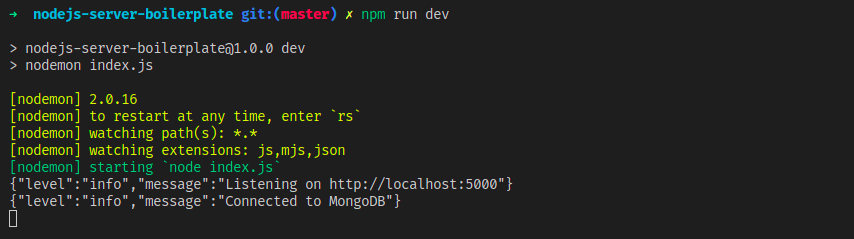

## Node.js Server boilerplate

**This boilerplate template is primarily designed to run with mongodb.**

**Environment Setup**

1. Clone the project and install the dependencies.

   ```bash
   $ git clone https://github.com/donymvarkey/nodejs-server-boilerplate.git
   $ cd nodejs-server-boilerplate
   $ npm install
   ```

2. Create a `.env` file in the root directory

3. Add your configs to the `.env` file

   ```te
   PORT='your_port'
   MONGO_URL='your_mongodb_url'
   SIGNATURE='your_secret'
   ```

4. Start the dev server

   ```bash
   $ npm run dev
   ```

   You should see the following log in the console.

   
